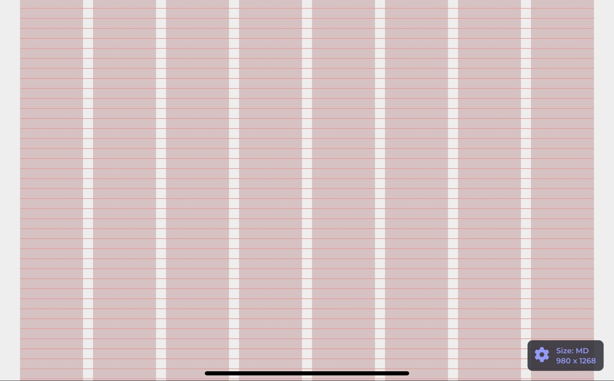
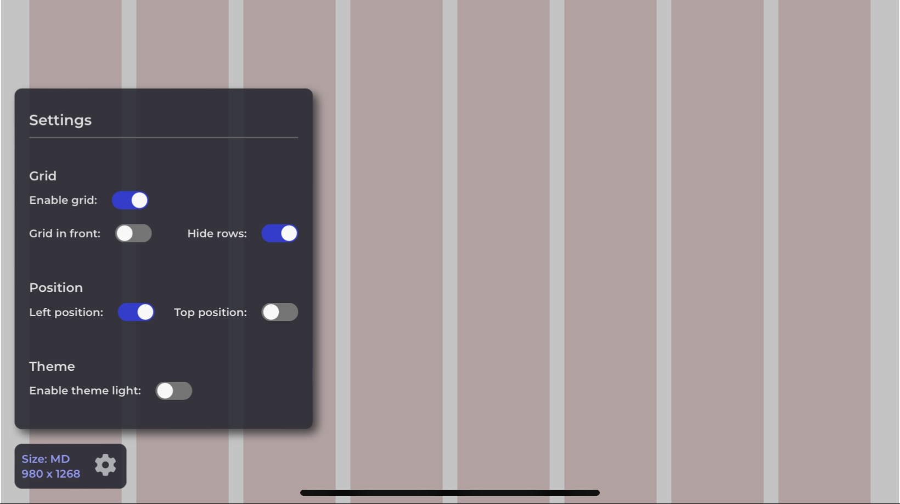

# react-responsive-detecter

Component for the development environment, which detects the screen size and generates a fully customizable responsive grid for React applications.

Keep component layout powerful and responsive, make sure all your development is vertically and horizontally aligned, spread your components evenly, make responsive development easy, use a persistent vertical rhythm in all your text.



The component helps the developer to detect the screen size in which he is working (XS, SM, MD, LG, XL, XX), so that the developer can adjust the styles of his project, according to a responsive design for each screen size.\
Likewise, this component also allows the developer to paint a grid on the entire screen, to serve as a guide in the development of its components, distribution of elements, alignment of texts, separation of elements, among other uses.\
This grid can be customized and disabled if desired.

> **Note:** :warning: This component is **only for the development environment**, so it is the responsibility of each developer, not to include this module in production, exclude it from the compilation bundle or disable it when the environment changes to be different from development. End users are not expected to see this component.

## Table of Contents

<!-- no toc -->
- [Installation](#installation)
- [Quick use](#quick-use)
- [Setting](#setting)
- [Props](#props)
- [Data Types](#data-types)
  - [ScreenSizesType](#screensizestype)
  - [ColumnDistributionType](#columndistributiontype)
  - [RowHeightType](#rowheighttype)
- [keep in mind when using any of these props](#keep-in-mind-when-using-any-of-these-props)
- [Resources](#resources)
- [License](#license)

## Installation

Using npm:

```bash
npm install --save-dev react-responsive-detecter

npm i -D react-responsive-detecter
```

## Quick use

The component is already configured with 6 breakpoints to be based on responsive development, but if these breakpoints do not suit your design or development template, you can modify their value for those you consider useful.

- Sample:

  The component is intended to be displayed on all screens as it is helpful for development, so a good place to mount it would be within your App component or within your route handler ([**react-router-dom**](https://reactrouter.com/en/v6.3.0/getting-started/installation) to mention one).\
  If this is not it, you are free to render it wherever you like, the component will still work correctly, this is just to help you decide where it would be good to mount it.

  - Example without react-router-dom:

  ```javascript
  import ResponsiveDetecter from 'react-responsive-detecter';

  const App = () => {
    return (
      <>
        <ResponsiveDetecter />

        <!-- other components... -->
      </>
    );
  };

  ```

  - Example with react-router-dom:

  ```javascript
  import ResponsiveDetecter from 'react-responsive-detecter';
  import { BrowserRouter, Routes, Route } from 'react-router-dom';

  const App = () => {
    return (
      <BrowserRouter>
        <ResponsiveDetecter />

        <!-- other components... -->
        <Routes>
          <Route path="/" element={<HomeScreen />} />
        </Routes>
      </BrowserRouter>
    );
  };

  ```

> **Important:** :exclamation: The component should not be rendered inside another component that prevents **ResponsiveDetecter** from occupying 100% of it's screen, since this component has the styles of: position: absolute, width: 100% and height: 100vh.

  :x: Bad usage example:

  ```javascript
  import ResponsiveDetecter from 'react-responsive-detecter';

  const App = () => {
    return (
      <div style={{ width: '50%', height: '500px' }}>
        <ResponsiveDetecter />

        <!-- other components... -->
      </div>
    );
  };

  ```

&nbsp;

## Setting

The component has a gear icon, which, when pressed, will display a menu of small settings that can be of great help when working with it.

> **Note:** :sunny: The configuration of these options is persisted in the localStorage of the browser under the key 'LayoutConfig', this is useful so that every time your project is opened in the same browser, the component respects its configuration.



- Enable grid:

  Disabling this option, will hide the entire grid, as well as its rows and columns.

- Grid in front:

  Enabling this option, will send the grid to the front of your development, by default it is at the bottom. This is useful when you have a component with a background color or an image, and you want these elements not to cover the rows or columns.

  > Doing this will help you align the elements that are inside other components with font color or text inside images, just keep in mind that since the grid is in front, many or all of its elements cannot be selected, since the grid is above them.

- Hide rows:

  Enabling this option, will hide all grid rows.

- Left position:

  Enabling this option, will position the component on the left side of your screen.

- Top position:

  Enabling this option, will position the component at the top side of your screen.

- Enable theme light:

  Enabling this option, will allow you to toggle between the light and dark theme of the component, menu and font color.

&nbsp;

## Props

  | Name | Type | Default | Description |
  |------|------|---------|-------------|
  | disable | boolean | false | Disable the component, this will prevent the functions and eventListeners from executing |
  | classNameContainer | string | N/A | Replace all styles of the container that wraps the columns and the grid |
  | screenSizes | ScreenSizesType | { XS: 350, SM: 600, MD: 905, LG: 1280, XL: 1440, XX: 1920 } | Allows you to customize all default screen sizes |
  | columnDistribution | ColumnDistributionType | { INIT: 3, XS: 6, MD: 8, LG: 12 } | Allows you to customize the number of columns in relation to the current screen size |
  | rowHeight | RowHeightType | 16 | Allows you to change the size of the grid rows |

## Data Types

Description of the data types used by some of the props.

### ScreenSizesType

  This data type is an object, where all its attributes are optional and have the following structure.

  **Interface:**

  | Name | Type | Required | Description |
  |------|------|----------|-------------|
  | XS | number | false | Screen size name to identify cell phone screens |
  | SM | number | false | Screen size name to identify screens of large cell phones or small tablets |
  | MD | number | false | Screen size name to identify tablets screens |
  | LG | number | false | Screen size name to identify screens large tablets or small laptops |
  | XL | number | false | Screen size name to identify large laptop screens or monitors |
  | XX | number | false | Screen size name to identify large monitors onwards |

### ColumnDistributionType

  This data type is an object, where only the **INIT** attribute is required, they have the following structure.

  **Interface:**

  | Name | Type | Required | Description |
  |------|------|----------|-------------|
  | INIT | 1 \\| 2 \\| 3 \\| 4 \\| 6 \\| 8 \\| 12 | true | Initial value, it is considered from 0 to the value less than the first breakpoint |
  | XS | 1 \\| 2 \\| 3 \\| 4 \\| 6 \\| 8 \\| 12 | false | The number of columns for this screen size |
  | SM | 1 \\| 2 \\| 3 \\| 4 \\| 6 \\| 8 \\| 12 | false | The number of columns for this screen size |
  | MD | 1 \\| 2 \\| 3 \\| 4 \\| 6 \\| 8 \\| 12 | false | The number of columns for this screen size |
  | LG | 1 \\| 2 \\| 3 \\| 4 \\| 6 \\| 8 \\| 12 | false | The number of columns for this screen size |
  | XL | 1 \\| 2 \\| 3 \\| 4 \\| 6 \\| 8 \\| 12 | false | The number of columns for this screen size |
  | XX | 1 \\| 2 \\| 3 \\| 4 \\| 6 \\| 8 \\| 12 | false | The number of columns for this screen size onwards |

### RowHeightType

  This data type is numeric, but can only take one of the following values.

  **Type:**

  | Name | Type | Description |
  |------|------|-------------|
  | rowHeight | 7 \\| 8 \\| 10 \\| 12 \\| 14 \\| 16 \\| 18 \\| 20 \\| 22 \\| 24 | Number of columns to render on a given screen size |

&nbsp;

## keep in mind when using any of these props

- **classNameContainer:**

  Passing an empty string will disable all styles in the container that wraps the grid, and will make the grid fill the full available width of the screen.\
  **This is not highly recommended**, as you should always develop with a maximum screen width limit and/or horizontal margins, to prevent your components from overflowing to full width on very large screens, or simply to prevent your text from sticking to the screen edge.

  ---

- **screenSizes:**

  You can modify the value of the breakpoints, but you cannot modify the name assigned to each of them.\
  If you don't want to include a screen name, what the component will do is take the next value it finds, either up or down.

  The order of values ​​that each screen name takes is described below, so if you try to pass something like, `{ MD: 1200, LG: 900 }`, this will throw you an error and not display the current screen size, until I correct this, since **MD cannot be greater than LG**, and so on with each of the screen names.

  > **Note:** From 0px to 349px, it is considered as an INIT size, and this is used to identify very very small screen sizes for which you no longer want to continue to find an optimal design, and the base styles of your spreadsheet. styles, before your first breakpoint, are what should be applied here.

  Default screenSizes:

  - XS: 350 - For mobile development
  - SM: 600 - For development on larger mobile phones or small tablets
  - MD: 905 - For tablet development
  - LG: 1280 - For development on large tablets or small laptops
  - XL: 1440 - For development on large laptops or monitors
  - XX: 1920 - For development on large monitors onwards

  Custom screenSizes:

  ```javascript
  import ResponsiveDetecter from 'react-responsive-detecter';

  const App = () => {
    return (
      <>
        <ResponsiveDetecter
          screenSizes={{ SM: 400, MD: 950, LG: 1280 }}
        />
      </>
    );
  };

  ```

  > This will cause only 4 breakpoints to be considered, from 0 to 399 as a INIT, from 400 to 949 for SM, from 950 to 1279 for MD, and 1280 onwards for LG.

  ---

- **columnDistribution:**

  You can modify the value of the column distribution by screen size, but you cannot modify the name assigned to each of them.\
  If you don't want to include a column layout for a screen size, what the component will do is take the next value it finds, either up or down, as long as it exists within the screen names.

  > **Note:** If you want to modify the number of columns per screen, you must take into account that the INIT attribute is the only attribute required when using this prop, that is, the new object that you provide to the component must at least contain the INIT attribute.

  Default columnDistribution:

  - INIT: 3 - Start layout, this applies when the screen size is less than SM
  - XS: 6 - Applies when screen size is less than MD but greater than or equal to SM
  - MD: 8 - Applies when screen size is less than LG but greater than or equal to MD
  - LG: 12 - Applies when the screen size is greater than or equal to LG

  Custom columnDistribution:

  ```javascript
  import ResponsiveDetecter from 'react-responsive-detecter';

  const App = () => {
    return (
      <>
        <ResponsiveDetecter
          screenSizes={{ SM: 400, MD: 950, LG: 1280 }}
          columnDistribution={{ INIT: 3, SM: 6, XL: 8 }}
        />
      </>
    );
  };

  ```

  > This will mean that if the current screen size is LG, since LG does not belong to the attributes declared in **columnDistribution**, the next value down will be taken, that is, the value of SM, since MD is not inside **columnDistribution** either.

  ---

&nbsp;

## Resources

If you have any ideas to improve this package or any functionality that you would expect it to have, feel free to write to me.

- [Changelog](CHANGELOG)

## License

[MIT](LICENSE)

&nbsp;
